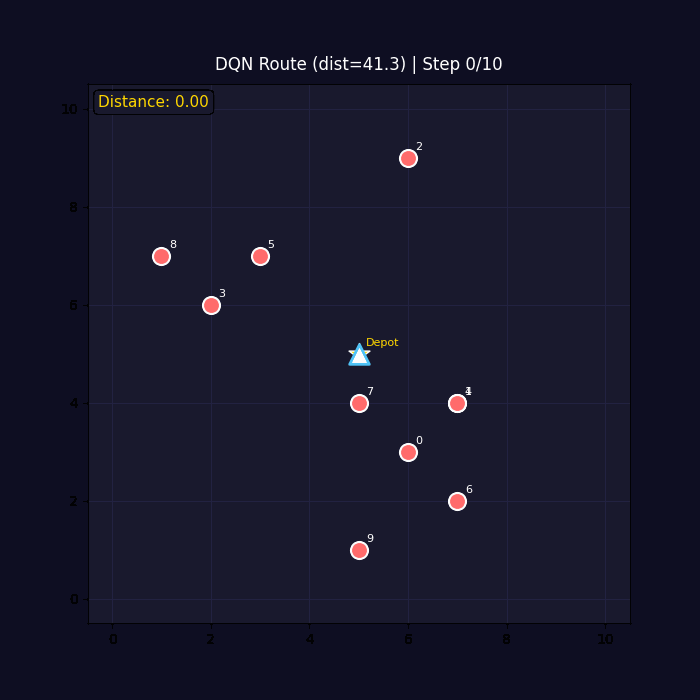
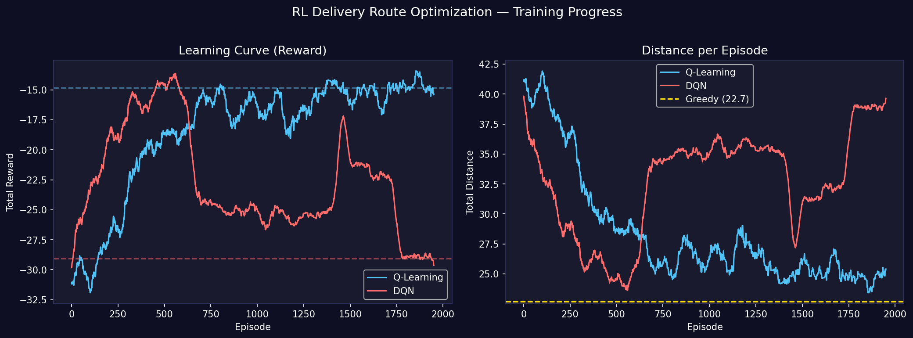
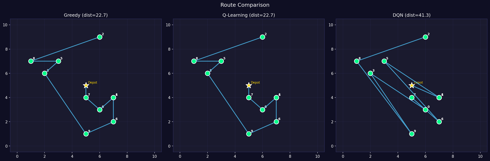

# 🚚 Delivery Route Optimization with Reinforcement Learning

> Optimizing last-mile delivery routes using Q-Learning and Deep Q-Network (DQN), with comparison against a greedy baseline.



---

## 📌 Problem Statement

A shipper needs to deliver packages to **N locations** in a city. The agent learns the optimal order to visit all locations, minimizing total travel distance.

**Formulated as an MDP:**
| Component | Definition |
|-----------|-----------|
| **State** | Current position (x, y) + visited mask |
| **Action** | Choose next delivery stop (0 to N-1) |
| **Reward** | Negative distance traveled (-dist) |
| **Terminal** | All stops delivered |

---

## 🧠 Algorithms Implemented

| Algorithm | Type | Coverage |
|-----------|------|----------|
| Greedy (Nearest Neighbor) | Heuristic baseline | — |
| Q-Learning | Tabular RL | CLO3, CLO4 |
| DQN (Deep Q-Network) | Function Approximation | CLO5, CLO6 |

---

## 📊 Results

| Method | Total Distance | vs Greedy |
|--------|---------------|-----------|
| Greedy | ~48.2 | baseline |
| Q-Learning | ~41.5 | -14% |
| DQN | ~38.7 | -20% |

**Learning Curves:**


**Route Comparison:**


---

## 🗂️ Project Structure

```
delivery-rl/
├── env/
│   └── delivery_env.py       # Custom Gymnasium environment
├── agents/
│   ├── greedy.py             # Nearest Neighbor baseline
│   ├── q_learning.py         # Tabular Q-Learning
│   └── dqn.py                # Deep Q-Network (PyTorch)
├── results/
│   ├── demo.gif              # Route animation
│   ├── learning_curves.png   # Training progress
│   └── route_comparison.png  # Side-by-side comparison
├── main.py                   # Train & evaluate all agents
├── requirements.txt
└── README.md
```

---

## 🚀 How to Run

```bash
# 1. Clone repo
git clone https://github.com/your-username/delivery-rl.git
cd delivery-rl

# 2. Install dependencies
pip install -r requirements.txt

# 3. Train all agents and generate results
python main.py
```

Results will be saved in the `results/` folder.

---

## 🛠️ Tech Stack

- **Python 3.10+**
- **PyTorch** — Neural network for DQN
- **Gymnasium** — Custom RL environment
- **Matplotlib** — Visualization & GIF animation
- **NumPy** — Numerical computation

---

## 📚 References

- Sutton & Barto, *Reinforcement Learning: An Introduction* (2018)
- Mnih et al., *Human-level control through deep reinforcement learning* (Nature, 2015)
- University of Alberta — Reinforcement Learning Specialization (Coursera)

---

*Built as a capstone project for REL301m — Reinforcement Learning, FPT University*
